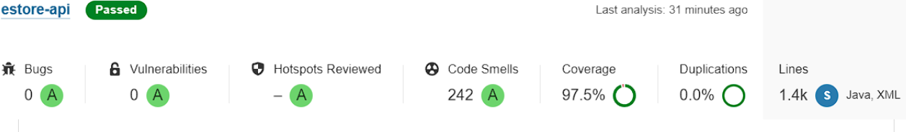
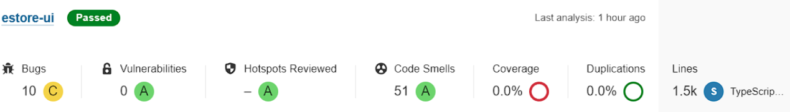

---
geometry: margin=1in
---
# PROJECT Design Documentation

> _The following template provides the headings for your Design
> Documentation.  As you edit each section make sure you remove these
> commentary 'blockquotes'; the lines that start with a > character
> and appear in the generated PDF in italics._

## Team Information
* Team name: Bovines (A)
* Team members
  * Max Bustillo
  * Chris Ferioli
  * Jakob Langtry
  * Vincent Sarubbi

## Executive Summary

This semester project is creating an online e-store selling non other than Dungeons & Dragons related items. These items include dice, boards, tokens, and figurines to help anyone immerse themselves in the world of D&D. The project includes having a customer interface that allows shoppers to login, add or remove products to their cart and checkout and their cart is saved even when they logout and log back in, while the owner can login with an admin account and add items to the shop and edit item info. Our own addition to the shop is an order menu that tracks customer orders and allows the owner to fulfill the order than alert the customer that their order is on the way. This includes showing the customers their order page with the orders they have checked out and the status of if it has been fulfilled or not. On the owner side they can view their pending orders and choose to fullfill them sending an email notification to the user as well as marking the customer order as fulfilled.

### Purpose
This project is targeted towards making an easy to use e-shop that sells D&D related items and allows owners to control inventory and ship out orders and lets users browse and add products to their orders and checkout and get notified when their order has been fulfilled.

### Glossary and Acronyms
> _Provide a table of terms and acronyms._

| Term | Definition |
|------|------------|
| SPA | Single Page |
| D&D | Dungeons & Dragons |

## Requirements

Login authentication for new/returning users and store owners. The customers can browse the inventory and search for specific products and add them to their shopping cart and keep them there even if they log out. Once ready to checkout the customer can checkout in the cart and get a notification that their order has been recieved and an email when it gets fulfilled.

An Owner can add, edit, or remove products from the inventory and see a list of orders currently pending from customers. The owner can then fulfill these orders and send an email notification to the customer as well as change the order status to fulfilled.

### Definition of MVP
The basic store should operate as one would expect. Customers can login/logout with their credentials but the wrong credentials won't get logged in. The customers can browse, search, and add/remove products to their cart. Once they are done shopping they can then checkout. Owners can add, delete, or edit products from the inventory.

### MVP Features
Minimal Authentication for customer/owner login. Customers can see a list of products, search for a product, and can add and remove items from their shopping cart as well as checkout. The owner can add, remove, or edit the products in the inventory. The customer shopping cart stays the same even when you log out and a new user logs in. The customer can see their currently placed orders and the status and the owner can see the placed orders and can fulfill them.
> _Provide a list of top-level Epics and/or Stories of the MVP._

### Roadmap of Enhancements
Pictures and descriptions for the products.
Create an order summary page for customers that shows thier past and placed orders and the status of whether they have been fulfilled or not.
Create the Owner order page where they can see the orders that customers placed and have the choice to fulfill them.
Send a notification out to customers upon checkout that the order has been recieved. A page after clicking checkout that says it has been placed.
Send an email to the customer once the owner has fulfilled the order.

## Application Domain

This section describes the application domain.

The e-store is the main focal point which owners and users login to. Once logged in the owner can add or remove products from the inventory and can see the order list of orders to fulfill. The User interacts with the inventory to add or remove products to their cart which then becomes an order after they checkout that then gets put into the order list.

## Architecture and Design

This section describes the application architecture.

### Summary

The following Tiers/Layers model shows a high-level view of the webapp's architecture.

The e-store web application, is built using the Model–View–ViewModel (MVVM) architecture pattern. 

The Model stores the application data objects including any functionality to provide persistance. 

The View is the client-side SPA built with Angular utilizing HTML, CSS and TypeScript. The ViewModel provides RESTful APIs to the client (View) as well as any logic required to manipulate the data objects from the Model.

Both the ViewModel and Model are built using Java and Spring Framework. Details of the components within these tiers are supplied below.

### Overview of User Interface

This section describes the web interface flow; this is how the user views and interacts
with the e-store application.
The user views and interacts with the e-store through our front end UI which starts at the login page and after a successful login displays the main page of the shop where a customer can go to the product, about us, or contact page. In the top right corner the customer can select their shopping cart to see the shopping cart page or a dropdown menu to logout or see their placed orders.

### View Tier

The base of the view is in the BS-navbar component, which is what loads every screen in the entire website. We started with this base as the products page, but it sort of created a organization hell. We looked at modern websites, and saw the navbar as sort of a universal element. We started from scratch, and moved away from the angular heroes project from the get-go. We then created components for every page we would need, then added a button to get there from the navbar, and then all we needed to add the finished webpages is put the right code ni the files that already existed, making this a lot easier.

### ViewModel Tier

The ViewModel Tier involves all of our typescript files in the estore-ui folder. These files include order.service , product.service, and user.service. These three files contain the logic that our store uses to handle the http responses given to it by the controller. The order.service and orderController communicate with each other in order to have the order functions working. The order.service class can respond with codes if the user tries to do something that is invalid such as searching for a product that doesn't exist. On the other hand the searchOrders method posts orders whose name contains the search term. The product.service file handles all operations from the server that deals with products. This includes getting products from the server and getting product by id. The service file also handles any save methods such as post requests to add a new product, delete requests to delete the product, and put requests to update products. These functions also come with error handling incase an owner is trying to update a product that doesn't exist, etc. These files respond to the controller responses and act accordingly depending on the type of request and if the data is valid. 

### Model Tier

Our Model Tier involves 4 classes representing a product, user, order, and orderDTO. The product class represents an item in the inventory that the owner is selling and the user can buy. The order class is used to set and get the price, name, id, and quantity, image, and description. The user class represents a user and contains the id, username, password, shopping cart, email. The shopping cart shows the users orders that they have purchased and the status of fulfillment (either fulfilled or not fulfilled). The order class represents a list of products that a user checks out with. The order class contains the set of products, the associated user and a unique identifier for the order. The orderDTO class is responsible for sending the order to the front end. This class serializes the order, giving it a total price and a size, this being the number of items in the order.

### Static Code Analysis/Design Improvements

If we were to continue the project we would like to address the typescript bugs. At the moment the static code tests include some bugs in the front end which should be addressed. Further there are some security concerns that need to be addressed. At the moment passwords are stored in plain text in a way that is hazardous. However the rest of our code shows a healthy and robust ecosystem which would be grown upon with the same diligence it was created with. This means we would continue to hold high standards of code coverage and quality periodically checking both to ensure that a critical mass of bugs does not overwhelm the project.

## Testing

### Acceptance Testing

All of our user stories have acceptance criteria and all of them have been fulfilled. In our project we tested all of our user stories that are testable other than the user stories that aren't such as doing the paper assignments for the sprints (retrospective etc.). Some of the issues found with acceptance testing were related to not enough acceptance criteria. Looking back on things we as a team would like to write more detailed acceptance criteria in order to test all aspects of the stories and code functions. 

### Unit Testing and Code Coverage

For unit testing, as we went through the code we made sure to be up to date with the unit testing and allocating a 3 point user story for code coverage. The person assigned to this story would go back at the end of the sprint and do some cleaning up and patching up any holes in the code. For every new code we added we made unit testing totaling around 120+ unit tests. We could improve unit testing to other code such as the typescript and go back as a team regularly throughout sprints in order to unit test more frequently. 
