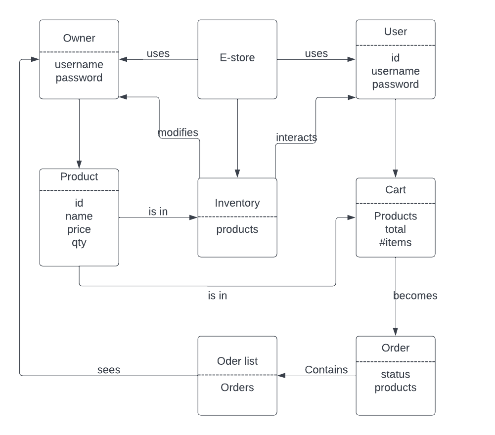

# PROJECT Design Documentation

> _The following template provides the headings for your Design
> Documentation.  As you edit each section make sure you remove these
> commentary 'blockquotes'; the lines that start with a > character
> and appear in the generated PDF in italics._

## Team Information
* Team name: Bovines (A)
* Team members
  * Max Bustillo
  * Chris Ferioli
  * Jakob Langtry
  * Vincent Sarubbi

## Executive Summary

This semester project is creating an online e-store selling non other than Dungeons & Dragons related items. These items include dice, boards, tokens, and figurines to help anyone immerse themselves in the world of D&D. The project includes having a customer interface that allows shoppers to login, add or remove products to their cart and checkout and their cart is saved even when they logout and log back in, while the owner can login with an admin account and add items to the shop and edit item info. Our own addition to the shop is an order menu that tracks customer orders and allows the owner to fulfill the order than alert the customer that their order is on the way. This includes showing the customers their order page with the orders they have checked out and the status of if it has been fulfilled or not. On the owner side they can view their pending orders and choose to fullfill them sending an email notification to the user as well as marking the customer order as fulfilled.

### Purpose
This project is targeted towards making an easy to use e-shop that sells D&D related items and allows owners to control inventory and ship out orders and lets users browse and add products to their orders and checkout and get notified when their order has been fulfilled.

### Glossary and Acronyms
> _Provide a table of terms and acronyms._

| Term | Definition |
|------|------------|
| SPA | Single Page |
| D&D | Dungeons & Dragons |

## Requirements

Login authentication for new/returning users and store owners. The customers can browse the inventory and search for specific products and add them to their shopping cart and keep them there even if they log out. Once ready to checkout the customer can checkout in the cart and get a notification that their order has been recieved and an email when it gets fulfilled.

An Owner can add, edit, or remove products from the inventory and see a list of orders currently pending from customers. The owner can then fulfill these orders and send an email notification to the customer as well as change the order status to fulfilled.

### Definition of MVP
The basic store should operate as one would expect. Customers can login/logout with their credentials but the wrong credentials won't get logged in. The customers can browse, search, and add/remove products to their cart. Once they are done shopping they can then checkout. Owners can add, delete, or edit products from the inventory.

### MVP Features
Minimal Authentication for customer/owner login. Customers can see a list of products, search for a product, and can add and remove items from their shopping cart as well as checkout. The owner can add, remove, or edit the products in the inventory. The customer shopping cart stays the same even when you log out and a new user logs in. The customer can see their currently placed orders and the status and the owner can see the placed orders and can fulfill them.
> _Provide a list of top-level Epics and/or Stories of the MVP._

### Roadmap of Enhancements
Pictures and descriptions for the products.
Create an order summary page for customers that shows thier past and placed orders and the status of whether they have been fulfilled or not.
Create the Owner order page where they can see the orders that customers placed and have the choice to fulfill them.
Send a notification out to customers upon checkout that the order has been recieved. A page after clicking checkout that says it has been placed.
Send an email to the customer once the owner has fulfilled the order.

## Application Domain

This section describes the application domain.

The e-store is the main focal point which owners and users login to. Once logged in the owner can add or remove products from the inventory and can see the order list of orders to fulfill. The User interacts with the inventory to add or remove products to their cart which then becomes an order after they checkout that then gets put into the order list.

## Architecture and Design

This section describes the application architecture.

### Summary

The following Tiers/Layers model shows a high-level view of the webapp's architecture.

The e-store web application, is built using the Model–View–ViewModel (MVVM) architecture pattern. 

The Model stores the application data objects including any functionality to provide persistance. 

The View is the client-side SPA built with Angular utilizing HTML, CSS and TypeScript. The ViewModel provides RESTful APIs to the client (View) as well as any logic required to manipulate the data objects from the Model.

Both the ViewModel and Model are built using Java and Spring Framework. Details of the components within these tiers are supplied below.

### Overview of User Interface

This section describes the web interface flow; this is how the user views and interacts
with the e-store application.
The user views and interacts with the e-store through our front end UI which starts at the login page and after a successful login displays the main page of the shop where a customer can go to the product, about us, or contact page. In the top right corner the customer can select their shopping cart to see the shopping cart page or a dropdown menu to logout or see their placed orders.

### View Tier
> _Provide a summary of the View Tier UI of your architecture.
> Describe the types of components in the tier and describe their
> responsibilities.  This should be a narrative description, i.e. it has
> a flow or "story line" that the reader can follow._

> _You must also provide sequence diagrams as is relevant to a particular aspects 
> of the design that you are describing.  For example, in e-store you might create a 
> sequence diagram of a customer searching for an item and adding to their cart. 
> Be sure to include an relevant HTTP reuqests from the client-side to the server-side 
> to help illustrate the end-to-end flow._

### ViewModel Tier
> _Provide a summary of this tier of your architecture. This
> section will follow the same instructions that are given for the View
> Tier above._

> _At appropriate places as part of this narrative provide one or more
> static models (UML class diagrams) with some details such as critical attributes and methods._

### Model Tier
> _Provide a summary of this tier of your architecture. This
> section will follow the same instructions that are given for the View
> Tier above._

> _At appropriate places as part of this narrative provide one or more
> static models (UML class diagrams) with some details such as critical attributes and methods._

### Static Code Analysis/Design Improvements
> _Discuss design improvements that you would make if the project were
> to continue. These improvement should be based on your direct
> analysis of where there are problems in the code base which could be
> addressed with design changes, and describe those suggested design
> improvements._

> _With the results from the Static Code Analysis exercise, 
> discuss the resulting issues/metrics measurements along with your analysis
> and recommendations for further improvements. Where relevant, include 
> screenshots from the tool and/or corresponding source code that was flagged._

## Testing
> _This section will provide information about the testing performed
> and the results of the testing._

### Acceptance Testing
> _Report on the number of user stories that have passed all their
> acceptance criteria tests, the number that have some acceptance
> criteria tests failing, and the number of user stories that
> have not had any testing yet. Highlight the issues found during
> acceptance testing and if there are any concerns._

### Unit Testing and Code Coverage
> _Discuss your unit testing strategy. Report on the code coverage
> achieved from unit testing of the code base. Discuss the team's
> coverage targets, why you selected those values, and how well your
> code coverage met your targets. If there are any anomalies, discuss
> those._
