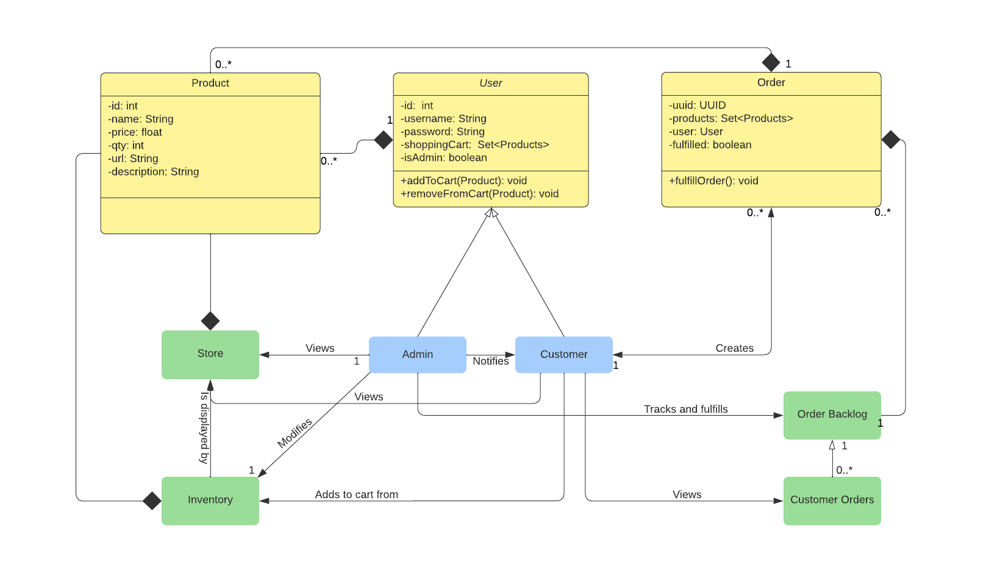

# PROJECT Design Documentation

> _The following template provides the headings for your Design
> Documentation.  As you edit each section make sure you remove these
> commentary 'blockquotes'; the lines that start with a > character
> and appear in the generated PDF in italics._

## Team Information
* Team name: Bovines (A)
* Team members
  * Max Bustillo
  * Chris Ferioli
  * Jakob Langtry
  * Vincent Sarubbi

## Executive Summary

This semester project is creating an online e-store selling non other than Dungeons & Dragons related items. These items include dice, boards, tokens, and figurines to help anyone immerse themselves in the world of D&D. The project includes having a customer interface that allows shoppers to login, add or remove products to their cart and checkout and their cart is saved even when they logout and log back in, while the owner can login with an admin account and add items to the shop and edit item info. Our own addition to the shop is an order menu that tracks customer orders and allows the owner to fulfill the order than alert the customer that their order is on the way. 

### Purpose
This project is targeted towards making an easy to use e-shop that sells D&D related items and allows owners to control inventory and ship out orders and lets users browse and add products to their orders and checkout and get notified when their order has been fulfilled.

### Glossary and Acronyms
> _Provide a table of terms and acronyms._

| Term | Definition |
|------|------------|
| SPA | Single Page |
| D&D | Dungeons & Dragons |

## Requirements

This section describes the features of the application.

* The central design of the store includes a user and an admin
* Both parties will have usernames and passwords which will allow them unique access to the store
* the admin will be able to manage teh store by adding deleting and modifying products 
* The user will be able to then borwse the store and add products to their shopping cart 
* The user must then be able to place an order which will be relayed to the admin 
* the admin will then be given the ability to send an automated email when the order is fulfilled 

### Definition of MVP
* A minimum viable product includes a store which can be logged into with 2 rolls 
* One which can add modify and delete products and teh other which can view them

### MVP Features
* A user identification system with differing privilidges 
* A user storage solution
* A product model with an assosiated storage solution
* A Robust front end with attractive design 

### Roadmap of Enhancements
* A check out page allowing the customer to purchase products 
* An order to keep track of each individual purchase 
* A way of displaying these orders for both users and the admin 
* An email system to send automated emails

## Application Domain

This section describes the application domain.

The e-store is the main focal point which owners and users login to. Once logged in the owner can add or remove products from the inventory and can see the order list of orders to fulfill. The User interacts with the inventory to add or remove products to their cart which then becomes an order after they checkout that then gets put into the order list.

## Architecture and Design

This section describes the application architecture.

### Summary

The following Tiers/Layers model shows a high-level view of the webapp's architecture.

The e-store web application, is built using the Model–View–ViewModel (MVVM) architecture pattern. 

The Model stores the application data objects including any functionality to provide persistance. 

The View is the client-side SPA built with Angular utilizing HTML, CSS and TypeScript. The ViewModel provides RESTful APIs to the client (View) as well as any logic required to manipulate the data objects from the Model.

Both the ViewModel and Model are built using Java and Spring Framework. Details of the components within these tiers are supplied below.

### Overview of User Interface

This section describes the web interface flow; this is how the user views and interacts
with the e-store application.

> _Provide a summary of the application's user interface.  Describe, from
> the user's perspective, the flow of the pages in the web application._

### View Tier
> _Provide a summary of the View Tier UI of your architecture.
> Describe the types of components in the tier and describe their
> responsibilities.  This should be a narrative description, i.e. it has
> a flow or "story line" that the reader can follow._

> _You must also provide sequence diagrams as is relevant to a particular aspects 
> of the design that you are describing.  For example, in e-store you might create a 
> sequence diagram of a customer searching for an item and adding to their cart. 
> Be sure to include an relevant HTTP reuqests from the client-side to the server-side 
> to help illustrate the end-to-end flow._

### ViewModel Tier
> _Provide a summary of this tier of your architecture. This
> section will follow the same instructions that are given for the View
> Tier above._

> _At appropriate places as part of this narrative provide one or more
> static models (UML class diagrams) with some details such as critical attributes and methods._

### Model Tier

* A product represents a single class of item on sale
* it includes a name quantity and price as well as an unique ID 
* An order consists of a list of products and a fulfillment status, the owner it belongs to and an unique ID
* Orders are only equal if their IDs are the same as any two Orders might contain identical products but still be unique
* The User represetns a single user split between the admin category and the customer category
* The User contians an ID a Username and a Password. these all distinguish two users from each other 

> _Provide a summary of this tier of your architecture. This
> section will follow the same instructions that are given for the View
> Tier above._

> _At appropriate places as part of this narrative provide one or more
> static models (UML class diagrams) with some details such as critical attributes and methods._

### Static Code Analysis/Design Improvements

* I would like to revisit how our utility functions are implimented. I found the static email class inelligent. 

> _Discuss design improvements that you would make if the project were
> to continue. These improvement should be based on your direct
> analysis of where there are problems in the code base which could be
> addressed with design changes, and describe those suggested design
> improvements._

> _With the results from the Static Code Analysis exercise, 
> discuss the resulting issues/metrics measurements along with your analysis
> and recommendations for further improvements. Where relevant, include 
> screenshots from the tool and/or corresponding source code that was flagged._

## Testing
> _This section will provide information about the testing performed
> and the results of the testing._

### Acceptance Testing
> _Report on the number of user stories that have passed all their
> acceptance criteria tests, the number that have some acceptance
> criteria tests failing, and the number of user stories that
> have not had any testing yet. Highlight the issues found during
> acceptance testing and if there are any concerns._

### Unit Testing and Code Coverage
* Our testing results report 100% passing with 100% coverage

> _Discuss your unit testing strategy. Report on the code coverage
> achieved from unit testing of the code base. Discuss the team's
> coverage targets, why you selected those values, and how well your
> code coverage met your targets. If there are any anomalies, discuss
> those._
